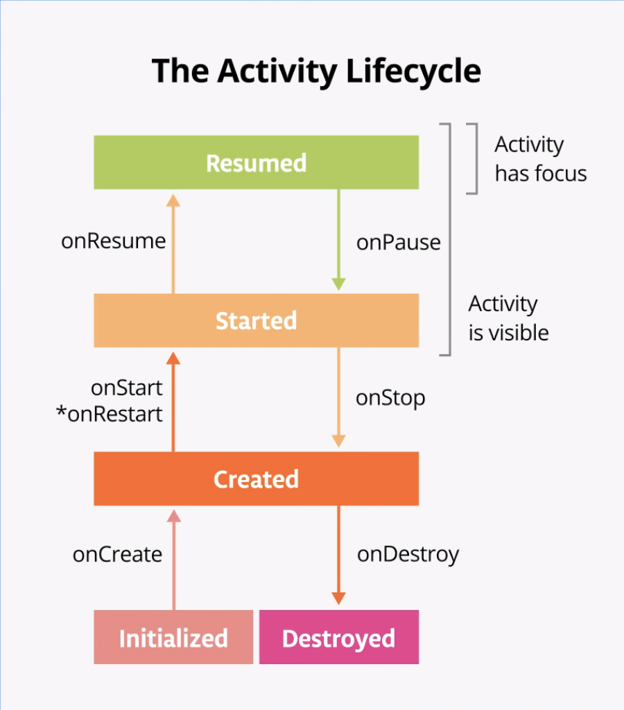

## [Lifecycle]

<br>



<br>

## [Back Button]
Tap the Back button on the device. Notice in Logcat that onPause(), onStop(), and onDestroy() are called, in that order.
In this case, using the Back button causes the activity (and the app) to be entirely closed. The execution of the onDestroy() method means that the activity was fully shut down and can be garbage-collected.
The activity was destroyed in the previous step, so when you return to the app, Android starts up a new activity and calls the onCreate(), onStart(), and onResume() methods.

## [Methods]

The onCreate() method is where you should do any one-time initializations for your activity.
The onCreate() lifecycle method is called once, just after the activity is initialized (when the new Activity object is created in memory). After onCreate() executes, the activity is considered created.

```
Note: When you override the onCreate() method, you must call the superclass implementation to complete the creation of the Activity, so within it, you must immediately call super.onCreate(). The same is true for other lifecycle callback methods.

```

The onStart() lifecycle method is called just after onCreate(). After onStart() runs, your activity is visible on the screen. Unlike onCreate(), which is called only once to initialize your activity, onStart() can be called many times in the lifecycle of your activity.

```
Note that onStart() is paired with a corresponding onStop() lifecycle method. If the user starts your app and then returns to the device's home screen, the activity is stopped and is no longer visible on screen.

```

```
Note: The important point here is that onStart() and onStop() are called multiple times as the user navigates to and from the activity.

These methods are called when the app is stopped and moved into the background, or when the app is started again when it returns to the foreground. If you need to do some work in your app during these cases, then override the relevant lifecycle callback method.

```


The onRestart() method is much like onCreate(). Either onCreate() or onRestart() is called before the activity becomes visible. The onCreate() method is called only the first time, and onRestart() is called after that. The onRestart() method is a place to put code that you only want to call if your activity is not being started for the first time.


The onSaveInstanceState() method is a callback you use to save any data that you might need if the Activity is destroyed. In the lifecycle callback diagram, onSaveInstanceState() is called after the activity has been stopped. It's called every time your app goes into the background.
Think of the onSaveInstanceState() call as a safety measure; it gives you a chance to save a small amount of information to a bundle as your activity exits the foreground. The system saves this data now because if it waited until it was shutting down your app, the system might be under resource pressure.
A Bundle is a collection of key-value pairs, where the keys are always strings. You can put simple data, such as Int and Boolean values, into the bundle. Because the system keeps this bundle in memory, it's a best practice to keep the data in the bundle small. The size of this bundle is also limited, though the size varies from device to device. If you store too much data, you risk crashing your app with the TransactionTooLargeException error
The putInt() method (and similar methods from the Bundle class like putFloat() and putString() takes two arguments: a string for the key (the KEY_REVENUE constant), and the actual value to save.

You use getInt() to get data out of the bundle, just as you used putInt() to put data into the bundle. The getInt() method takes two arguments:

A string that acts as the key, for example "key_revenue" for the revenue value.
A default value in case no value exists for that key in the bundle.

```

override fun onSaveInstanceState(outState: Bundle) {
   super.onSaveInstanceState(outState)

   Log.d(TAG, "onSaveInstanceState Called")
   outState.putInt(KEY_REVENUE, 12)
}

```

```
"Put this on override fun onCreate"

if (savedInstanceState != null) {
   revenue = savedInstanceState.getInt(KEY_REVENUE, 0)
}
```


