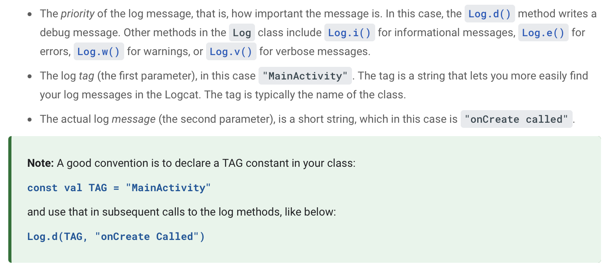
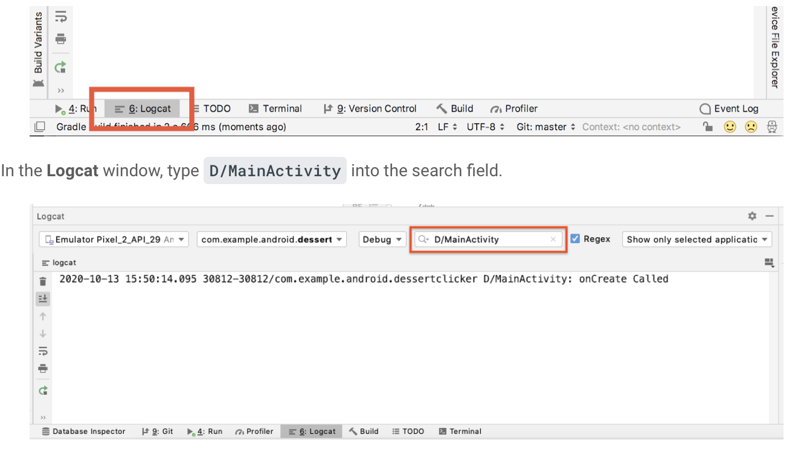

## [Logs]

The Log class writes messages to the Logcat. The Logcat is the console for logging messages. Messages from Android about your app appear here, including the messages you explicitly send to the log with the Log.d() method or other Log class methods.

<br>



<br>

```
import android.util.Log

```
