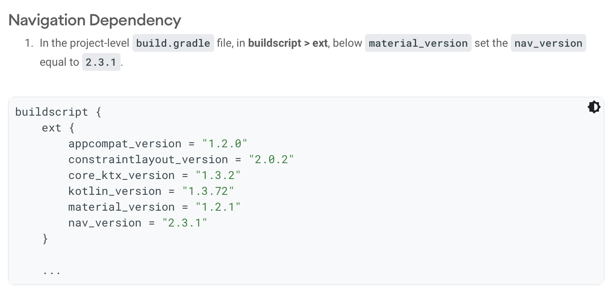
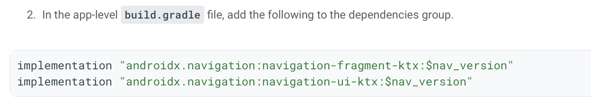
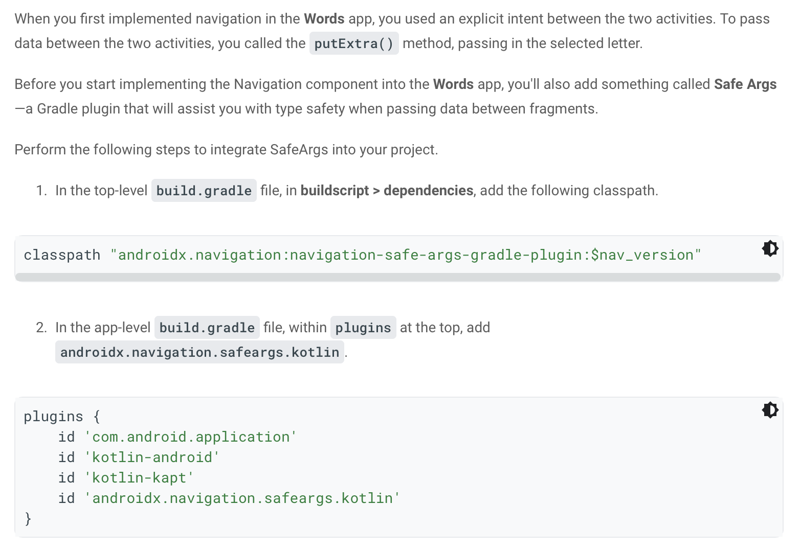

## [Navigation] (https://developer.android.com/codelabs/basic-android-kotlin-training-fragments-navigation-component?continue=https%3A%2F%2Fdeveloper.android.com%2Fcourses%2Fpathways%2Fandroid-basics-kotlin-unit-3-pathway-2%23codelab-https%3A%2F%2Fdeveloper.android.com%2Fcodelabs%2Fbasic-android-kotlin-training-fragments-navigation-component#7)

Android Jetpack libraries are a collection of libraries to make it easier for you to develop great Android apps. These libraries help you follow best practices, free you from writing boilerplate code, and simplify complex tasks, so you can focus on the code you care about, like the app logic.

Android Jetpack provides the Navigation component to help you handle any navigation implementation, simple or complex, in your app. The Navigation component has three key parts which you'll use to implement navigation in the Words app.

* Navigation Graph: The navigation graph is an XML file that provides a visual representation of navigation in your app. The file consists of destinations which correspond to individual activities and fragments as well as actions between them which can be used in code to navigate from one destination to another. Just like with layout files, Android Studio provides a visual editor to add destinations and actions to the navigation graph.

* NavHost: A NavHost is used to display destinations form a navigation graph within an activity. When you navigate between fragments, the destination shown in the NavHost is updated. You'll use a built-in implementation, called NavHostFragment, in your MainActivity.

* NavController: The NavController object lets you control the navigation between destinations displayed in the NavHost. When working with intents, you had to call startActivity to navigate to a new screen. With the Navigation component, you can call the NavController's navigate() method to swap the fragment that's displayed. The NavController also helps you handle common tasks like responding to the system "up" button to navigate back to the previously displayed fragment.

### Navigation Dependency

<br>



<br>


```

buildscript {
    ext {
        appcompat_version = "1.2.0"
        constraintlayout_version = "2.0.2"
        core_ktx_version = "1.3.2"
        kotlin_version = "1.3.72"
        material_version = "1.2.1"
        nav_version = "2.3.1"
    }

```

<br>



<br>


```

implementation "androidx.navigation:navigation-fragment-ktx:$nav_version"
implementation "androidx.navigation:navigation-ui-ktx:$nav_version"

```


### Safe Args Plugin

<br>



<br>

