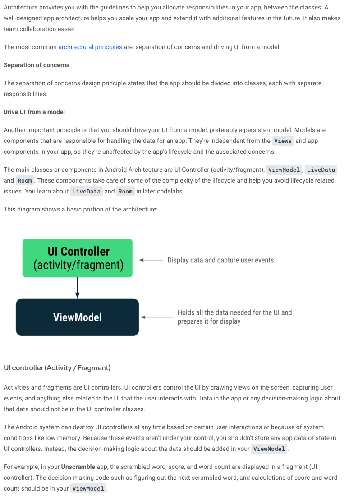
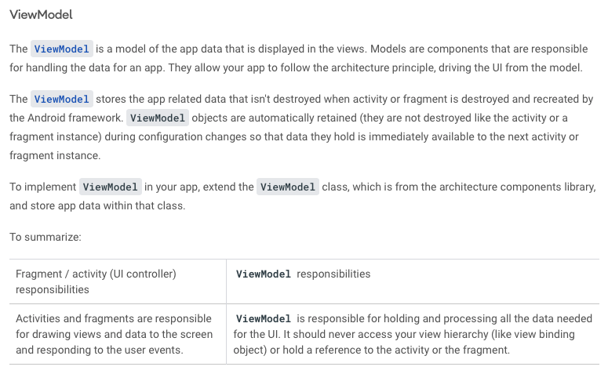
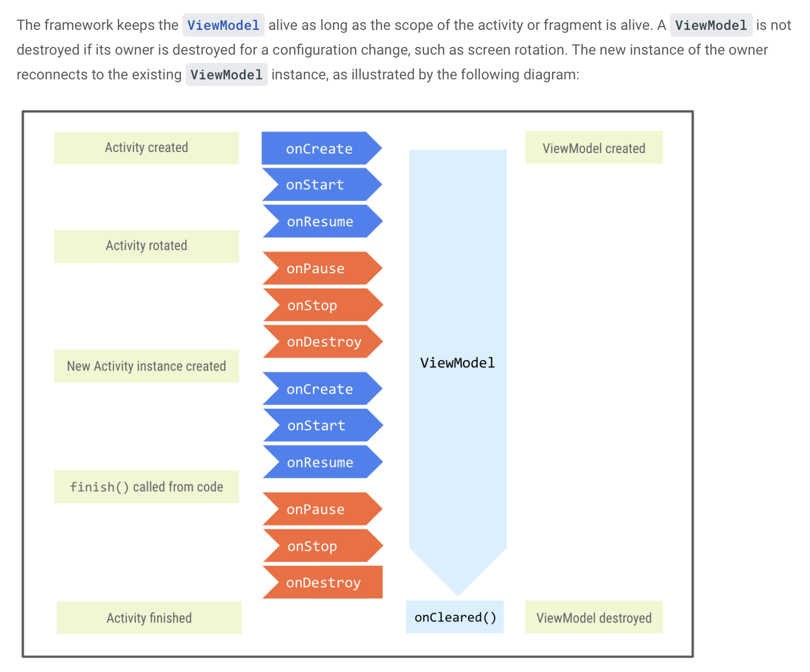
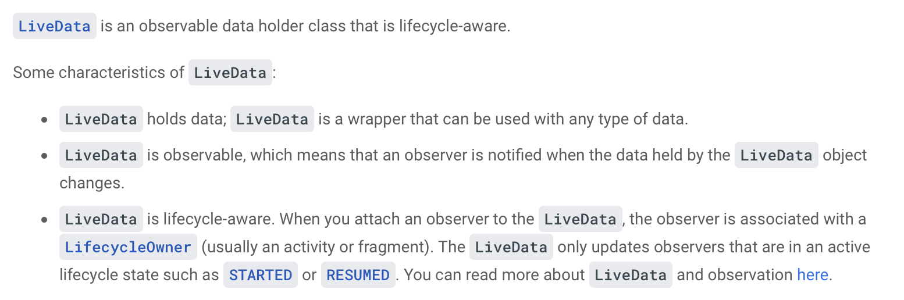

## [Crash Course on Kotlin](https://developer.android.com/codelabs/basic-android-kotlin-training-viewmodel?continue=https%3A%2F%2Fdeveloper.android.com%2Fcourses%2Fpathways%2Fandroid-basics-kotlin-unit-3-pathway-3%23codelab-https%3A%2F%2Fdeveloper.android.com%2Fcodelabs%2Fbasic-android-kotlin-training-viewmodel#0)

You have learned in the previous codelabs the lifecycle of activities and fragments and the related lifecycle issues with configuration changes. To save the app data, saving the instance state is one option, but it comes with its own limitations. In this codelab you learn about a robust way to design your app and preserve app data during configuration changes, by taking advantage of Android Jetpack libraries.

Android Jetpack libraries are a collection of libraries to make it easier for you to develop great Android apps. These libraries help you follow best practices, free you from writing boilerplate code, and simplify complex tasks, so you can focus on the code you care about, like the app logic.

Android Architecture Components are part of Android Jetpack libraries, to help you design apps with good architecture. Architecture Components provide guidance on app architecture, and it is the recommended best practice.

App architecture is a set of design rules. Much like the blueprint of a house, your architecture provides the structure for your app. A good app architecture can make your code robust, flexible, scalable and maintainable for years to come.

### Separation of concerns

 

 

### ViewModel

 

 

### LiveData

 

 

