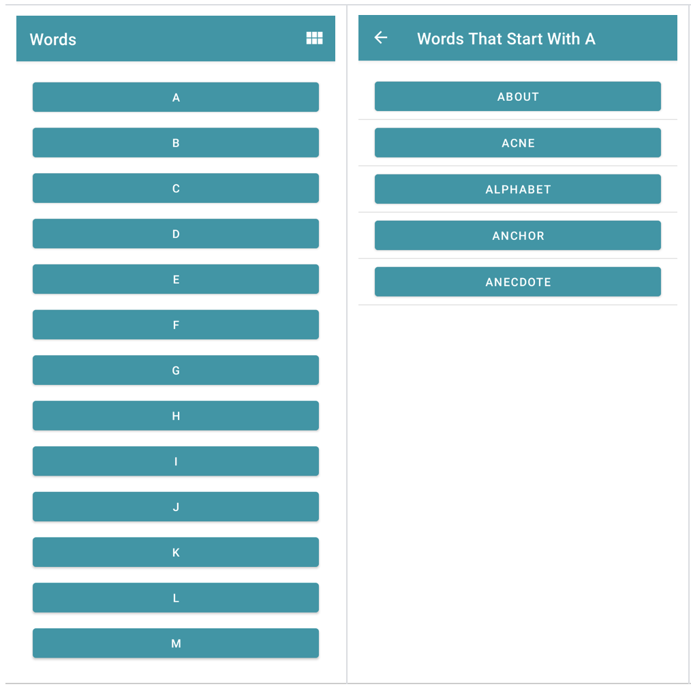

## [Word List]

## [Crash Course on Kotlin](https://developer.android.com/codelabs/basic-android-kotlin-training-activities-intents?continue=https%3A%2F%2Fdeveloper.android.com%2Fcourses%2Fpathways%2Fandroid-basics-kotlin-unit-3-pathway-1%23codelab-https%3A%2F%2Fdeveloper.android.com%2Fcodelabs%2Fbasic-android-kotlin-training-activities-intents#0)

 

* This repository written for reference and self-documentation purpose
* Feel free to contribute!

 
